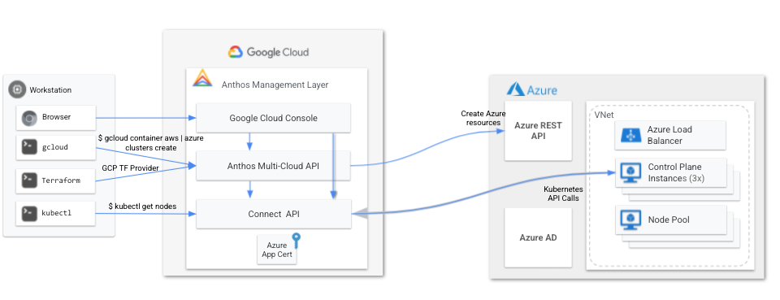

# Install GKE on Azure using Terraform

This script is meant to be a quick start to working with Anthos on Azure. For more information on Anthos Multi-Cloud please [click here](https://cloud.google.com/anthos/clusters/docs/multi-cloud/). This terraform script will install all relevant IaaS in Azure _(VNet, App Registration, Resource Groups, KMS)_.



 **The Terraform script deploys Anthos GKE with:**
- 3 control plane nodes _(1 in each AZ)_ of type [Standard_B2s](https://docs.microsoft.com/en-us/azure/virtual-machines/sizes-b-series-burstable)
- A single node pool of type Standard_B2s with 1 node in an autoscaling group to max 3 nodes to the `Azure East US` region.

**Other information:**
- Supported instance types in Azure can be found [here](https://cloud.google.com/anthos/clusters/docs/multi-cloud/azure/reference/supported-vms).
- You can adjust the region and AZs in the [variables.tf](/anthos-multi-cloud/Azure/variables.tf) file.
- For a list of Azure regions and associated K8s version supported per GCP region please use the following command:
```bash
gcloud alpha container azure get-server-config --location [gcp-region]
```
After the cluster has been installed it will show up in the [Kubernetes Engine page](https://console.cloud.google.com/kubernetes/list/overview) of the GCP console in your relevant GCP project.

## Prerequisites

1. Ensure you have gCloud SDK 365.0.1 or greater [installed](https://cloud.google.com/sdk/docs/install)
   ```
   gcloud components update
   ```

1. Download the `az` CLI utility. Ensure it is in your `$PATH`.

   ```bash
   curl -L https://aka.ms/InstallAzureCli | bash
   ```

1. Log in to your Azure account and get account details.

   ```bash
   az login
   ```

1. Set the following variables for Azure Terraform authentication. The example uses [Azure CLI](https://registry.terraform.io/providers/hashicorp/azurerm/latest/docs/guides/azure_cli) way of authenticating Terraform.

   ```bash
   export ARM_SUBSCRIPTION_ID=$(az account show --query "id" --output tsv)
   export ARM_TENANT_ID=$(az account list --query "[?id=='${ARM_SUBSCRIPTION_ID}'].{tenantId:tenantId}" --output tsv)

   echo -e "ARM_SUBSCRIPTION_ID is ${ARM_SUBSCRIPTION_ID}"
   echo -e "ARM_TENANT_ID is ${ARM_TENANT_ID}"
   ```

   Ouput looks like the following

   ```
   ARM_SUBSCRIPTION_ID is abcdef123-abcd-1234-aaaa-12345abcdef
   ARM_TENANT_ID is 1230982dfd-123a-1234-7a54-12345abcdef
   ```

## Prepare Terraform

1. Configure GCP Terraform authentication.

   ```bash
   echo PROJECT_ID=Your GCP Project ID

   gcloud config set project "${PROJECT_ID}"
   gcloud auth application-default login --no-launch-browser
   ```

1. Enable services in your GCP project.

   ```bash
   gcloud --project="${PROJECT_ID}" services enable \
   gkemulticloud.googleapis.com \
   gkeconnect.googleapis.com \
   connectgateway.googleapis.com \
   cloudresourcemanager.googleapis.com \
   anthos.googleapis.com \
   logging.googleapis.com \
   monitoring.googleapis.com
   ```

1. Clone this repo and go into the Azure folder.

   ```bash
   git clone https://github.com/GoogleCloudPlatform/anthos-samples.git
   cd anthos-samples/anthos-multi-cloud/Azure
   ```

## Deploy Anthos Clusters(GKE) on Azure cluster

1. Edit the following values in the **terraform.tfvars** file. The admin user will be the GCP account email address that can login to the clusters once they are created via the connect gateway.

  ```bash
   gcp_project_id = "xxx-xxx-xxx"
   admin_user = "example@example.com"
   ```

1. Initialize and create terraform plan.

   ```bash
   terraform init
   ```

1. Apply terraform.

   ```bash
   terraform apply
   ```
    Once started the installation process will take about 12 minutes. **After the script completes you will see a var.sh file in the root directory that has varialbles for the anthos install** if you need to create more node pools manually in the future. Note manually created node pools will need to be deleted manually before you run terraform destroy

1. Authorize Cloud Logging / Cloud Monitoring

   Enable system container logging and container metrics. You can only do this after the first Anthos cluster has been created.
   ([read more](https://cloud.google.com/anthos/clusters/docs/multi-cloud/aws/how-to/create-cluster#telemetry-agent-auth))

   ``` bash
   gcloud projects add-iam-policy-binding ${PROJECT_ID} \
   --member="serviceAccount:${PROJECT_ID}.svc.id.goog[gke-system/gke-telemetry-agent]" \
   --role=roles/gkemulticloud.telemetryWriter
   ```

 1. Login to the Cluster

   ```bash
   gcloud container hub memberships get-credentials [cluster name]
   kubectl get nodes
   ```
## Extra: Connect Anthos Configuration Management

If you would like to test out the Anthos Configuration and Policy Management feature you can visit this [quickstart](https://cloud.google.com/anthos-config-management/docs/archive/1.9/config-sync-quickstart).

## Delete Anthos on Azure Cluster

1. Run the following command to delete Anthos on Azure cluster.

   ```bash
   terraform destroy
   ```

<!-- BEGIN_TF_DOCS -->
## Requirements

| Name | Version |
|------|---------|
| <a name="requirement_terraform"></a> [terraform](#requirement\_terraform) | >= 0.13 |
| <a name="requirement_google"></a> [google](#requirement\_google) | >= 4.5.0 |

## Providers

| Name | Version |
|------|---------|
| <a name="provider_random"></a> [random](#provider\_random) | 3.5.1 |
| <a name="provider_tls"></a> [tls](#provider\_tls) | 4.0.4 |

## Modules

| Name | Source | Version |
|------|--------|---------|
| <a name="module_aad_app"></a> [aad\_app](#module\_aad\_app) | ./modules/aad-app | n/a |
| <a name="module_anthos_cluster"></a> [anthos\_cluster](#module\_anthos\_cluster) | ./modules/anthos_cluster | n/a |
| <a name="module_cluster_rg"></a> [cluster\_rg](#module\_cluster\_rg) | ./modules/cluster-rg | n/a |
| <a name="module_cluster_vnet"></a> [cluster\_vnet](#module\_cluster\_vnet) | ./modules/cluster-vnet | n/a |
| <a name="module_create_vars"></a> [create\_vars](#module\_create\_vars) | terraform-google-modules/gcloud/google | n/a |
| <a name="module_gcp_data"></a> [gcp\_data](#module\_gcp\_data) | ./modules/gcp_data | n/a |

## Resources

| Name | Type |
|------|------|
| [random_string.suffix](https://registry.terraform.io/providers/hashicorp/random/latest/docs/resources/string) | resource |
| [tls_private_key.anthos_ssh_key](https://registry.terraform.io/providers/hashicorp/tls/latest/docs/resources/private_key) | resource |

## Inputs

| Name | Description | Type | Default | Required |
|------|-------------|------|---------|:--------:|
| <a name="input_admin_user"></a> [admin\_user](#input\_admin\_user) | GCP User to give admin RBAC to in the cluster | `string` | n/a | yes |
| <a name="input_azure_region"></a> [azure\_region](#input\_azure\_region) | Azure region to deploy to | `string` | n/a | yes |
| <a name="input_cluster_version"></a> [cluster\_version](#input\_cluster\_version) | GKE version to install | `string` | n/a | yes |
| <a name="input_gcp_location"></a> [gcp\_location](#input\_gcp\_location) | GCP region to deploy the multi-cloud API | `string` | n/a | yes |
| <a name="input_gcp_project_id"></a> [gcp\_project\_id](#input\_gcp\_project\_id) | GCP project ID to register the Anthos Cluster to | `string` | n/a | yes |
| <a name="input_name_prefix"></a> [name\_prefix](#input\_name\_prefix) | prefix of all artifacts created and cluster name | `string` | n/a | yes |
| <a name="input_node_pool_instance_type"></a> [node\_pool\_instance\_type](#input\_node\_pool\_instance\_type) | Azure instance type for node pool | `string` | n/a | yes |

## Outputs

| Name | Description |
|------|-------------|
| <a name="output_cluster_name"></a> [cluster\_name](#output\_cluster\_name) | The automatically generated name of your Azure GKE cluster |
| <a name="output_cluster_resource_group"></a> [cluster\_resource\_group](#output\_cluster\_resource\_group) | VNET Resource Group |
| <a name="output_message"></a> [message](#output\_message) | Connect Instructions |
| <a name="output_vars_file"></a> [vars\_file](#output\_vars\_file) | The variables needed to create more node pools are in the vars.sh file.<br> If you create additional node pools they must be manually deleted before you run terraform destroy |
| <a name="output_vnet_resource_group"></a> [vnet\_resource\_group](#output\_vnet\_resource\_group) | VNET Resource Group |
<!-- END_TF_DOCS -->